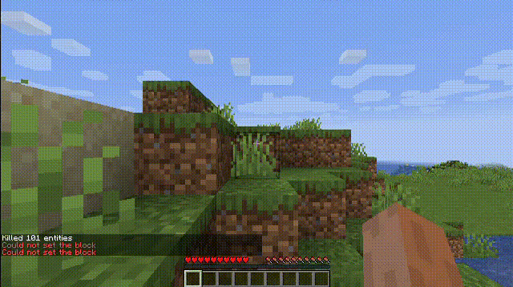

<h1 align="center">
minerl-combat
</h1>
<p align="center">



</p>
<p align="center">
This is a fork of <a href="https://github.com/minerllabs/minerl">minerl v1.0.0</a> with additional gym environments for player versus mob combat scenarios. Although combat is our focus, this package provides an interface for setting up environments via a list of minecraft chat commands; this can potentially be extended for many other scenarios.
</p>

## Requirements

These are not set in stone and you may be able to get this to work with different versions, but these are safe options that should work 🤞

- Linux
- Java 8 ([Oracle recommended](https://www.oracle.com/java/technologies/javase/javase8-archive-downloads.html))
- Python 3.9.16

## Installation

Remove any existing minerl installation

```sh
pip uninstall minerl -y
```

Clone this repository

```sh
git clone https://github.com/jhsul/minerl-combat
cd minerl-combat
```

Install with pip (this may take awhile)

```sh
pip install -r requirements.txt
pip install .
```

## Environments

This fork introduces the following environments:

- `MineRLPunchCow-v0`
- `MineRLPunchCowEz-v0` (cow cannot die)
- `MineRLPunchCowEzTest-v0` (cow can die)
- `MineRLFightSkeleton-v0`
- `MineRLFightZombie-v0`
- `MineRLEnderdragon-v0`

## Basic Usage

```python
import logging
import gym
import minerl
import coloredlogs

coloredlogs.install(logging.DEBUG)

env = gym.make("MineRLPunchCow-v0")
env.reset()

done = False

while not done:
    # do nothing
    ac = env.action_space.noop()
    obs, reward, done, info = env.step(ac)

    env.render()

env.close()
```

## Usage with VPT

To see this in action with VPT, please install `minerl-combat` as per the instructions and check out our other repository, [BattleCraftRL](https://github.com/jhsul/battle-craft-rl).
